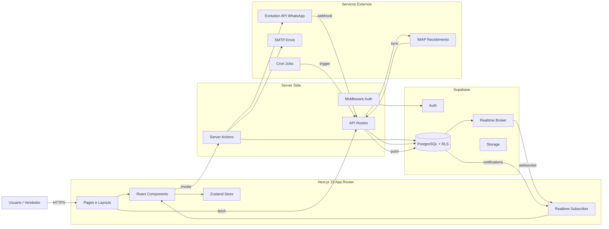
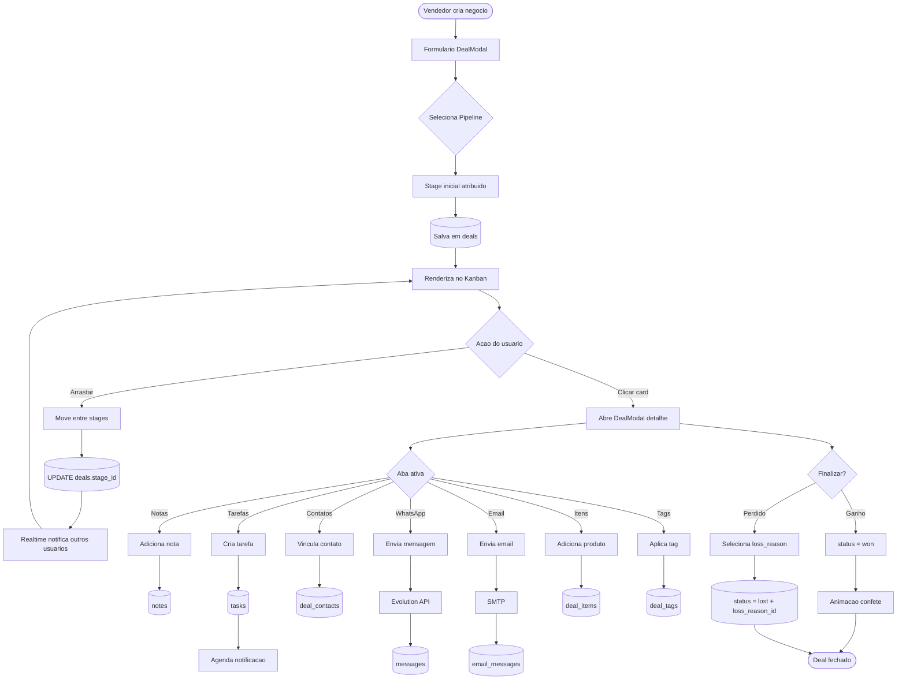
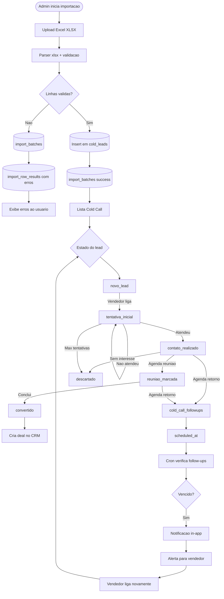

# Sistema CRM NG

Documentação técnica e visual do sistema CRM NG. Contém diagramas de arquitetura, modelo de dados, fluxos de negócio e status atual das features.

Stack principal: Next.js 15 (App Router), Supabase (PostgreSQL + RLS + Realtime), Evolution API (WhatsApp), SMTP/IMAP (Email), Recharts, Zustand, TailwindCSS.

---

## 1. Arquitetura Geral do Sistema

---

## 2. ERD - Entidades Principais

```mermaid
erDiagram
    tenants ||--o{ profiles : "possui"
    tenants ||--o{ pipelines : "possui"
    tenants ||--o{ deals : "possui"
    tenants ||--o{ contacts : "possui"
    tenants ||--o{ companies : "possui"
    tenants ||--o{ products : "possui"
    tenants ||--o{ tags : "possui"
    tenants ||--o{ cold_leads : "possui"
    tenants ||--o{ email_accounts : "possui"
    tenants ||--o{ whatsapp_instances : "possui"
    tenants ||--o{ loss_reasons : "possui"
    tenants ||--o{ quick_replies : "possui"
    tenants ||--o{ custom_field_definitions : "possui"
    tenants ||--o{ team_invites : "possui"
    tenants ||--o{ audit_logs : "registra"

    profiles ||--o{ deals : "owner"
    profiles ||--o{ notes : "autor"
    profiles ||--o{ tasks : "assigned"
    profiles ||--o{ notifications : "destinatario"
    profiles ||--o{ notification_settings : "configura"
    profiles ||--o{ deal_members : "membro"
    profiles ||--o{ cold_leads : "assigned"
    profiles ||--o{ email_accounts : "owner"

    pipelines ||--o{ stages : "contem"
    pipelines ||--o{ deals : "organiza"
    stages ||--o{ deals : "atual"

    deals ||--o{ deal_contacts : "liga"
    deals ||--o{ deal_members : "equipe"
    deals ||--o{ deal_tags : "tagged"
    deals ||--o{ deal_items : "itens"
    deals ||--o{ notes : "anotado"
    deals ||--o{ tasks : "tarefas"
    deals ||--o{ messages : "whatsapp"
    deals }o--|| loss_reasons : "motivo_perda"

    contacts ||--o{ deal_contacts : "aparece"
    contacts }o--o| companies : "trabalha"
    contacts ||--o{ messages : "conversa"

    tags ||--o{ deal_tags : "aplicada"
    products ||--o{ deal_items : "usado"

    cold_leads ||--o{ cold_lead_notes : "anotacoes"
    cold_leads ||--o{ cold_call_followups : "followups"
    cold_leads ||--o{ tasks : "tarefas"

    email_accounts ||--o{ email_messages : "envia_recebe"
    email_accounts ||--o{ email_threads : "organiza"
    email_accounts ||--o{ email_drafts : "rascunhos"
    email_accounts ||--o{ email_logs : "auditoria"
    email_threads ||--o{ email_messages : "contem"
    email_messages ||--o{ email_attachments : "anexos"
    email_templates ||--o{ email_template_usage : "usado_em"
    email_templates ||--o{ email_drafts : "base"

    whatsapp_instances ||--o{ messages : "canal"

    import_batches ||--o{ import_row_results : "linhas"

    tenants {
        uuid id PK
        text name
        timestamptz created_at
    }
    profiles {
        uuid id PK
        uuid tenant_id FK
        text full_name
        text role
        text email
    }
    pipelines {
        uuid id PK
        uuid tenant_id FK
        text name
        boolean is_default
    }
    stages {
        uuid id PK
        uuid pipeline_id FK
        text name
        int position
    }
    deals {
        uuid id PK
        uuid tenant_id FK
        uuid pipeline_id FK
        uuid stage_id FK
        uuid owner_id FK
        uuid contact_id FK
        uuid loss_reason_id FK
        text title
        numeric value
        text status
        jsonb custom_fields
        timestamptz created_at
    }
    deal_contacts {
        uuid deal_id FK
        uuid contact_id FK
        text role
    }
    deal_members {
        uuid deal_id FK
        uuid user_id FK
        text role
    }
    deal_tags {
        uuid deal_id FK
        uuid tag_id FK
    }
    deal_items {
        uuid id PK
        uuid deal_id FK
        uuid product_id FK
        int quantity
        numeric unit_price
    }
    contacts {
        uuid id PK
        uuid tenant_id FK
        uuid company_id FK
        text name
        text email
        text phone
    }
    companies {
        uuid id PK
        uuid tenant_id FK
        text name
        text cnpj
    }
    cold_leads {
        uuid id PK
        uuid tenant_id FK
        uuid assigned_to FK
        text nome
        text telefone
        text status
        int tentativas
    }
    cold_lead_notes {
        uuid id PK
        uuid cold_lead_id FK
        uuid author_id FK
        text content
    }
    cold_call_followups {
        uuid id PK
        uuid cold_lead_id FK
        timestamptz scheduled_at
        text status
    }
    notes {
        uuid id PK
        uuid deal_id FK
        uuid author_id FK
        text content
    }
    tasks {
        uuid id PK
        uuid deal_id FK
        uuid cold_lead_id FK
        uuid assigned_to FK
        text title
        timestamptz due_at
        boolean done
    }
    messages {
        uuid id PK
        uuid tenant_id FK
        uuid contact_id FK
        uuid deal_id FK
        text direction
        text content
        timestamptz created_at
    }
    email_accounts {
        uuid id PK
        uuid tenant_id FK
        uuid user_id FK
        text email
        text smtp_password_enc
        text imap_password_enc
    }
    email_messages {
        uuid id PK
        uuid account_id FK
        uuid thread_id FK
        text subject
        text body
        text direction
    }
    email_threads {
        uuid id PK
        uuid account_id FK
        text subject
    }
    email_templates {
        uuid id PK
        uuid tenant_id FK
        text name
        text body
    }
    email_drafts {
        uuid id PK
        uuid account_id FK
        text subject
        text body
    }
    email_attachments {
        uuid id PK
        uuid message_id FK
        text filename
        text storage_path
    }
    email_template_usage {
        uuid id PK
        uuid template_id FK
        uuid message_id FK
    }
    email_logs {
        uuid id PK
        uuid account_id FK
        text action
        jsonb payload
    }
    products {
        uuid id PK
        uuid tenant_id FK
        text name
        numeric price
    }
    tags {
        uuid id PK
        uuid tenant_id FK
        text name
        text color
    }
    quick_replies {
        uuid id PK
        uuid tenant_id FK
        text shortcut
        text content
    }
    loss_reasons {
        uuid id PK
        uuid tenant_id FK
        text name
    }
    import_batches {
        uuid id PK
        uuid tenant_id FK
        text source
        int total_rows
        int success_rows
        int error_rows
    }
    import_row_results {
        uuid id PK
        uuid batch_id FK
        int row_number
        text status
        jsonb errors
    }
    audit_logs {
        uuid id PK
        uuid tenant_id FK
        uuid actor_id FK
        text action
        jsonb payload
    }
    notifications {
        uuid id PK
        uuid user_id FK
        text type
        text title
        boolean read
    }
    notification_settings {
        uuid user_id PK
        boolean email_enabled
        boolean push_enabled
    }
    whatsapp_instances {
        uuid id PK
        uuid tenant_id FK
        text instance_name
        text status
    }
    custom_field_definitions {
        uuid id PK
        uuid tenant_id FK
        text entity
        text field_key
        text field_type
    }
    team_invites {
        uuid id PK
        uuid tenant_id FK
        text email
        text role
        text token
    }
```

---

## 3. Fluxo de um Negocio (Deal)

---

## 4. Fluxo de Cold Call

---

# Status das Features

| Feature | Status | Arquivos principais | Observacao |
|---|---|---|---|
| Kanban CRM (Pipelines/Stages/Deals) | OK | `frontend/app/(protected)/deals/*`, `frontend/app/actions.ts` | Drag-and-drop funcional via @hello-pangea/dnd, realtime OK |
| Deal Detail + Notas/Tarefas/Contatos | OK | `frontend/components/DealModal*`, `frontend/app/actions.ts` | Abas completas |
| Cold Call | OK | `frontend/app/(protected)/cold-call/*`, `supabase/migrations/20251211000000_create_cold_leads.sql` | Estados e transicoes funcionando |
| Import de Leads Excel | Parcial | `frontend/app/actions.ts` (xlsx), `supabase/migrations/20260126130000_advanced_import_tables.sql` | Funciona mas sem dashboard de historico de erros para o admin |
| Email completo (SMTP/IMAP) | OK | `frontend/app/(protected)/emails/*`, `frontend/app/actions-email.ts`, `frontend/lib/encryption.ts` | Envio, recebimento, threads, templates, drafts e anexos funcionando |
| WhatsApp (Evolution API) | OK | `frontend/app/(protected)/chat/*`, `frontend/app/(protected)/ngzap/*`, migrations `whatsapp_instances` | Envio e recebimento via webhook funcionando |
| Dashboard / Analytics | OK | `frontend/app/(protected)/dashboard/*` | Recharts com metricas de funil, conversao e ticket medio |
| Campos Personalizados | Parcial | `supabase/migrations/*custom_field_definitions*`, `frontend/components/DealModal*` | Backend e tabela OK mas frontend nao renderiza os campos dinamicos no DealModal |
| Notificacoes | Parcial | `frontend/lib/notifications.ts`, migration `20260128000000_create_notifications.sql` | Infra criada (tabela, settings, UI de sino) mas faltam triggers de eventos automaticos alem de tasks |
| Audit Logs | Parcial | migration `audit_logs` | Tabela existe e algumas actions gravam, mas nao ha UI para visualizacao |
| Auto-dial Cold Call | Fake | `frontend/app/(protected)/cold-call/*` | Usa localStorage para simular, nao integra com discador real |
| Email re-encrypt on update | Bug | `frontend/lib/encryption.ts`, `frontend/app/actions-email.ts` | Atualizacao de email_account esta re-encriptando senha ja encriptada ou salvando em claro dependendo do caminho |
| Multi-tenant + RLS | OK | `supabase/migrations/*`, `frontend/app/actions.ts` (getTenantId) | Isolamento por tenant_id em todas as tabelas |
| Auth + Roles (admin/vendedor) | OK | `frontend/app/auth/*`, `frontend/middleware.ts` | Login, registro, setup inicial de tenant |
| Team Invites | OK | migration `team_invites`, `frontend/app/(protected)/settings/*` | Convites por email com token |

---

# Upgrades Priorizados

## P0 - Critico (seguranca e dados)

- **Corrigir bug de re-encrypt em email_accounts**: auditar `frontend/lib/encryption.ts` e os updates em `actions-email.ts` para garantir que senhas SMTP/IMAP sejam sempre decriptadas, modificadas e re-encriptadas exatamente uma vez. Adicionar teste de roundtrip.
- **Hardening de RLS em tabelas sensiveis**: revisar policies em `email_messages`, `messages`, `notifications` para garantir isolamento estrito por `tenant_id` e `user_id`.
- **Rotacao de chave de criptografia**: definir `ENCRYPTION_KEY` fora de env comum e documentar processo de rotacao.

## P1 - Alto (features parciais que prometem valor)

- **Renderizar campos personalizados no DealModal**: ler `custom_field_definitions` do tenant e renderizar inputs dinamicos (text/number/date/select) com persistencia em `deals.custom_fields` (jsonb). Mesmo padrao para contacts e cold_leads.
- **Triggers automaticos de notificacao**: disparar `notifications` quando (a) deal muda de stage, (b) deal atribuido a outro vendedor, (c) mensagem WhatsApp nova sem resposta, (d) email recebido, (e) cold lead follow-up vencendo.
- **Dashboard de historico de importacoes**: tela em settings mostrando `import_batches` com drill-down em `import_row_results`, permitindo re-download de erros em Excel.
- **UI de Audit Logs**: tela em settings (somente admin) listando `audit_logs` com filtros por ator, acao e periodo.
- **Auto-dial real**: integrar com discador (CallTrackingMetrics, Twilio ou equivalente) substituindo o fake de localStorage.

## P2 - Medio (qualidade, DX e performance)

- **Testes automatizados**: adicionar Vitest para server actions criticas (deals, cold_leads, email) e Playwright para fluxo Kanban end-to-end.
- **Otimizacao do Kanban**: paginar ou virtualizar stages com mais de 100 deals para evitar travamento.
- **Rate limit nas API routes**: especialmente webhooks da Evolution API e sync IMAP.
- **Observabilidade**: Sentry para erros de client/server e logs estruturados nas actions.
- **Templates de email com variaveis dinamicas avancadas**: suporte a loops e condicionais alem de simples placeholders.
- **Export de dados**: botao de exportar deals/contacts/cold_leads em CSV/XLSX respeitando filtros.
- **Dark mode consistente**: rodar `check-theme` e corrigir divergencias encontradas.
- **Documentacao de API interna**: gerar doc automatica das server actions e tipos.
